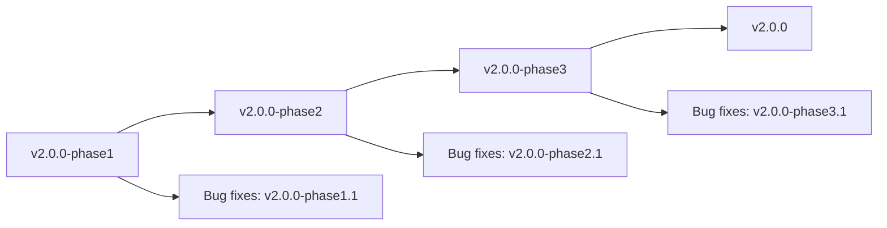
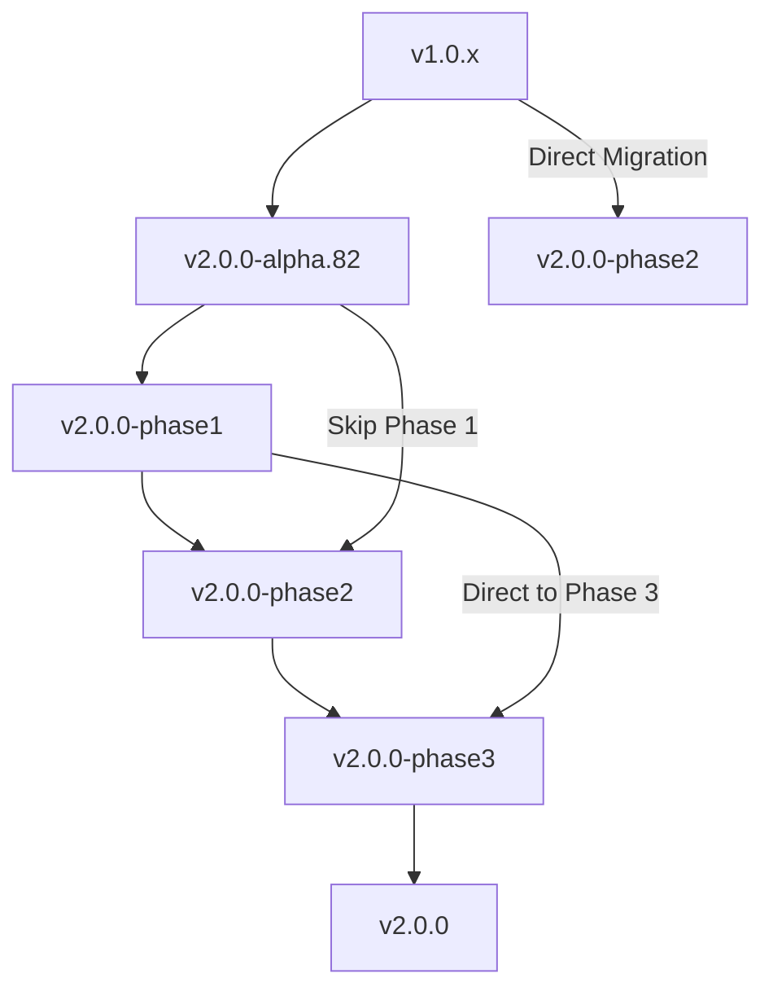

# Claude Flow Version Strategy

## 🎯 **Versioning Philosophy**

Claude Flow follows a comprehensive versioning strategy that ensures predictable releases, clear compatibility, and smooth upgrade paths for enterprise deployments.

### 📋 **Version Naming Convention**

#### **Release Types**
```
Production:     2.0.0, 2.1.0, 2.1.1
Release Candidate: 2.1.0-rc.1, 2.1.0-rc.2
Beta:           2.1.0-beta.1, 2.1.0-beta.2
Alpha:          2.1.0-alpha.1, 2.1.0-alpha.82
Development:    2.1.0-dev.123, 2.1.0-dev.abc123
Phase Releases: 2.0.0-phase1, 2.0.0-phase2, 2.0.0-phase3
```

#### **Semantic Versioning (SemVer)**
```
MAJOR.MINOR.PATCH[-PRERELEASE][+BUILD]

MAJOR: Breaking changes, incompatible API changes
MINOR: New features, backward compatible
PATCH: Bug fixes, backward compatible
PRERELEASE: alpha, beta, rc, phase1, phase2
BUILD: Build metadata, commit hashes
```

### 🏗️ **Release Phases**

#### **Phase Release Strategy**
Claude Flow uses phase releases for major feature rollouts:



**Phase 1**: Core Infrastructure
- Basic agent coordination
- Memory management
- CLI foundation
- Testing infrastructure

**Phase 2**: Executive Assistant System ⭐ **(Current Release)**
- 17-agent executive assistant
- Advanced coordination
- Performance optimization
- Production-ready deployment

**Phase 3**: Enterprise Features
- Multi-tenant support
- Advanced security
- Enterprise integrations
- Cloud deployment

### 📅 **Release Schedule**

#### **Release Cadence**
```
Production Releases:    Quarterly (Jan, Apr, Jul, Oct)
Minor Updates:          Monthly
Patch Releases:         As needed (hotfixes)
Alpha Releases:         Weekly (development builds)
Beta Releases:          Bi-weekly (feature testing)
Phase Releases:         Major milestone releases
```

#### **2025 Release Calendar**

| Month | Release Type | Version | Features |
|-------|-------------|---------|----------|
| **Jan** | **Phase 2** | **v2.0.0-phase2** | **Executive Assistant Complete** |
| Feb | Minor | v2.1.0 | Performance improvements |
| Mar | Patch | v2.1.1-2 | Bug fixes, stability |
| **Apr** | **Phase 3** | **v2.0.0-phase3** | **Enterprise Features** |
| May | Minor | v2.2.0 | New agent types |
| Jun | Patch | v2.2.1-2 | Security updates |
| **Jul** | **Major** | **v2.0.0** | **Production Release** |
| Aug | Minor | v2.3.0 | UI improvements |
| Sep | Patch | v2.3.1-2 | Performance tuning |
| **Oct** | **Major** | **v3.0.0** | **Next Generation** |

### 🔄 **Branch Strategy**

#### **Git Flow Model**
```
main                    ─────●─────●─────●───── (Production releases)
├── release/v2.0.0      ────────●───●────────── (Release preparation)
├── develop             ─●─●─●─●─●─●─●─●─●─●─●── (Integration branch)
├── feature/assistant   ───●───●───●──────────── (Feature development)
├── feature/performance ─────●───●───●────────── (Performance features)
└── hotfix/critical     ───────────────●─────── (Emergency fixes)
```

#### **Branch Naming Conventions**
```bash
# Feature branches
feature/executive-assistant
feature/performance-optimization
feature/github-integration

# Release branches
release/v2.0.0-phase2
release/v2.1.0
release/v2.0.0

# Hotfix branches
hotfix/v2.0.0-phase2.1
hotfix/security-patch
hotfix/memory-leak

# Development branches
develop
main
```

### 🏷️ **Tag Strategy**

#### **Tag Naming**
```bash
# Production releases
v2.0.0
v2.1.0
v2.1.1

# Phase releases
v2.0.0-phase1
v2.0.0-phase2
v2.0.0-phase3

# Pre-releases
v2.1.0-alpha.1
v2.1.0-beta.1
v2.1.0-rc.1

# Build tags
v2.1.0-dev.123
v2.1.0+build.abc123
```

#### **Tag Automation**
```bash
# Automated tagging on release
git tag -a v2.0.0-phase2 -m "Executive Assistant Phase 2 Complete"
git push origin v2.0.0-phase2

# Automated NPM version update
npm version 2.0.0-phase2 --no-git-tag-version
npm publish --tag phase2

# GitHub release creation
gh release create v2.0.0-phase2 \
  --title "Claude Flow v2.0.0-phase2: Executive Assistant Complete" \
  --notes-file RELEASE_NOTES_v2.0.0-phase2.md \
  --prerelease
```

### 📦 **Distribution Strategy**

#### **NPM Package Distribution**
```bash
# Production channel
npm install claude-flow                    # Latest stable
npm install claude-flow@2.0.0             # Specific version

# Phase releases
npm install claude-flow@phase2            # Latest phase 2
npm install claude-flow@2.0.0-phase2     # Specific phase

# Pre-release channels
npm install claude-flow@alpha             # Latest alpha
npm install claude-flow@beta              # Latest beta
npm install claude-flow@rc                # Latest RC

# Development builds
npm install claude-flow@dev               # Latest dev build
```

#### **Package Tags**
```json
{
  "dist-tags": {
    "latest": "2.0.0",
    "phase1": "2.0.0-phase1",
    "phase2": "2.0.0-phase2",
    "phase3": "2.0.0-phase3",
    "alpha": "2.1.0-alpha.82",
    "beta": "2.1.0-beta.5",
    "rc": "2.1.0-rc.1",
    "dev": "2.1.0-dev.123"
  }
}
```

### 🔧 **Compatibility Matrix**

#### **Version Compatibility**

| Version | Node.js | NPM | Claude API | Breaking Changes |
|---------|---------|-----|------------|------------------|
| v2.0.0-phase2 | 20+ | 9+ | v1 | Yes (from v1.x) |
| v2.0.0-phase1 | 20+ | 9+ | v1 | Yes (from v1.x) |
| v2.0.0-alpha.82 | 18+ | 8+ | v1 | Yes (from v1.x) |
| v1.0.73 | 16+ | 7+ | v1 | No |

#### **Migration Paths**



### 🧪 **Testing Strategy**

#### **Testing by Release Type**

**Alpha Releases** (Weekly)
- Unit tests (95%+ coverage)
- Basic integration tests
- Automated smoke tests
- Development environment only

**Beta Releases** (Bi-weekly)
- Full test suite
- Performance benchmarks
- Security scans
- Staging environment testing

**Release Candidates** (Pre-production)
- Production-like testing
- Load testing
- User acceptance testing
- Security audits

**Production Releases**
- All tests passing
- Performance validation
- Security certification
- Documentation complete

#### **Automated Testing Pipeline**
```yaml
# .github/workflows/release.yml
name: Release Pipeline
on:
  push:
    tags: ['v*']

jobs:
  test:
    runs-on: ubuntu-latest
    steps:
      - name: Unit Tests
        run: npm test
      - name: Integration Tests
        run: npm run test:integration
      - name: Performance Tests
        run: npm run test:performance
      
  security:
    runs-on: ubuntu-latest
    steps:
      - name: Security Scan
        run: npm audit
      - name: SAST Analysis
        run: npm run security:scan
        
  release:
    needs: [test, security]
    runs-on: ubuntu-latest
    steps:
      - name: Create GitHub Release
        run: gh release create ${{ github.ref_name }}
      - name: Publish to NPM
        run: npm publish
```

### 📊 **Metrics and Monitoring**

#### **Release Metrics**
```bash
# Track release adoption
claude-flow analytics release-adoption --version v2.0.0-phase2

# Monitor version distribution
claude-flow analytics version-distribution --last-30-days

# Track upgrade success rates
claude-flow analytics upgrade-success --from v2.0.0-alpha.82 --to v2.0.0-phase2

# Performance regression detection
claude-flow analytics performance-regression --baseline v2.0.0-phase1
```

#### **Quality Gates**

**Pre-Release Quality Gates**
- [ ] All tests passing (100%)
- [ ] Code coverage >95%
- [ ] Performance benchmarks meet targets
- [ ] Security scan clean
- [ ] Documentation complete
- [ ] Migration guide available
- [ ] Rollback procedures tested

**Post-Release Monitoring**
- [ ] Error rate <1% within 24 hours
- [ ] Performance within 10% of baseline
- [ ] No critical security issues
- [ ] Adoption rate >50% within 7 days
- [ ] Support ticket volume normal

### 🔄 **Deprecation Strategy**

#### **Deprecation Timeline**
```
Announcement → Warning → Deprecation → Removal
     ↓           ↓           ↓          ↓
   Release     3 months    6 months   12 months
```

#### **Deprecation Process**
1. **Announcement** - Feature marked for deprecation in release notes
2. **Warning Period** - Runtime warnings added, documentation updated
3. **Deprecation** - Feature disabled by default, removal warning
4. **Removal** - Feature completely removed in next major version

#### **Backward Compatibility**
```bash
# Compatibility layer for deprecated features
claude-flow --deprecated-api-warning
claude-flow migrate --from v1.x --to v2.x --check-compatibility
claude-flow config validate --show-deprecated
```

### 📝 **Documentation Versioning**

#### **Documentation Strategy**
```
docs/
├── v2.0.0-phase2/      # Current release docs
├── v2.0.0-phase1/      # Previous phase docs
├── v2.0.0-alpha.82/    # Alpha docs (archived)
├── migration-guides/   # Version migration guides
├── compatibility/      # Compatibility matrices
└── archive/           # Historical documentation
```

#### **Documentation Automation**
```bash
# Generate version-specific docs
claude-flow docs generate --version v2.0.0-phase2 --format html,pdf

# Update compatibility matrix
claude-flow docs update-compatibility --test-matrix

# Generate migration guide
claude-flow docs migration-guide --from v2.0.0-alpha.82 --to v2.0.0-phase2
```

### 🚀 **Release Automation**

#### **Automated Release Pipeline**
```bash
#!/bin/bash
# release.sh - Automated release script

VERSION=$1
TYPE=$2  # alpha, beta, rc, phase, production

# Validate version
if ! claude-flow version validate "$VERSION"; then
    echo "Invalid version format: $VERSION"
    exit 1
fi

# Run quality gates
npm run test:all
npm run security:scan
npm run performance:benchmark

# Update version
npm version "$VERSION" --no-git-tag-version

# Build release artifacts
npm run build
npm run package

# Create git tag
git tag -a "v$VERSION" -m "Release v$VERSION"

# Create GitHub release
gh release create "v$VERSION" \
    --title "Claude Flow v$VERSION" \
    --notes-file "RELEASE_NOTES_v$VERSION.md" \
    $([ "$TYPE" != "production" ] && echo "--prerelease")

# Publish to NPM
npm publish --tag "$TYPE"

# Deploy to staging/production
if [ "$TYPE" = "production" ]; then
    claude-flow deploy production --version "$VERSION"
else
    claude-flow deploy staging --version "$VERSION"
fi

echo "✅ Release v$VERSION completed successfully"
```

### 📞 **Support Strategy**

#### **Support Lifecycle**
```
Version          Support Level    End of Life
v2.0.0-phase2    Full Support     2025-07-01
v2.0.0-phase1    Security Only    2025-04-01
v2.0.0-alpha.82  Community Only   2025-01-01
v1.0.73          Legacy Support   2025-04-01
```

#### **Support Channels**
- **Production Versions** - Full support with SLA
- **Phase Releases** - Active development support
- **Beta/RC** - Testing and feedback support
- **Alpha** - Community and developer support only
- **Deprecated** - Security patches only

---

## 🎯 **Current Status: v2.0.0-phase2**

### **Release Information**
- **Version**: v2.0.0-phase2
- **Release Date**: January 2025
- **Support Level**: Full Support
- **Next Release**: v2.0.0-phase3 (April 2025)

### **Upgrade Paths**
- **From v1.x**: Use migration tools, breaking changes
- **From v2.0.0-alpha.82**: Direct upgrade, configuration migration
- **From v2.0.0-phase1**: Direct upgrade, feature additions

### **Quick Version Commands**
```bash
# Check current version
claude-flow --version

# Check for updates
claude-flow update check

# View version history
claude-flow version history

# Validate compatibility
claude-flow version compatible --target v2.0.0-phase2
```

---

**This version strategy ensures reliable, predictable releases that support enterprise deployment needs while maintaining backward compatibility and clear upgrade paths.**